# HireFlow Backend

HireFlow REST API. It manages job posts / candidate applications (career) and academy form / evaluation flows. Authentication uses Supabase JWT; roles are read from the `USER_ROLE` table in PostgreSQL.

Matching UI: [hireflow-frontend](https://github.com/aliefecakir/hireflow-frontend)

## What it does

Two product lines share the same API:

**Career (`/api/v1`)**

- List active job posts
- HR create, update, and status changes (`ACTV` / `PASS` / `DRFT`)
- Candidate applies to a post and lists their own applications
- HR manages applications (`WAIT` / `REVIEW` / `APPR` / `REJ`)
- Candidate profile (phone, education, experience, skills, languages)
- Current-user profile and admin role assignment

**Academy (`/api/academy`)**

- Public form list and apply (login not required)
- Forms, question bank, university / department catalogs, organizations
- Application evaluation, manual scores, status history
- General parameters (`GNL_PARM`, e.g. career portal on/off)

## Stack

- Java 21
- Spring Boot 3.3.3
- Spring Web, Data JPA, Validation
- Spring Security + OAuth2 Resource Server (Supabase JWT, ES256 / JWKS)
- PostgreSQL
- springdoc-openapi (Swagger UI)
- Lombok

Version: `1.0.1` (`pom.xml`)

Hibernate uses `ddl-auto: validate`: the app does not create the schema; it binds to an existing database.

## Architecture

```
Frontend (Bearer JWT)
        │
        ▼
SecurityFilterChain
  - public academy GET/POST
  - other /api/**  → JWT required
        │
JwtAuthConverter
  - JWT email / sub
  - USER + USER_ROLE (IS_ACTV=1)
  - ROLE_<SHRT_CODE>
        │
Controller → Service → Repository → PostgreSQL
```

Layers:

```
src/main/java/com/hireflow/backend/
  controller/   REST endpoints
  service/      business rules
  repository/   Spring Data JPA
  entity/       tables
  dto/          request / response records
  security/     JWT → roles, academy RBAC
  config/       CORS, JWT decoder, filter chain
```

## Authentication and roles

The frontend obtains an access token from Supabase and sends it as `Authorization: Bearer`. The backend verifies the signature with Supabase JWKS (`SUPABASE_JWT_JWK_SET_URI`).

Authorities do not come from the JWT `role` claim. `JwtAuthConverter` looks up the `USER` row by email and maps active `USER_ROLE` rows to `ROLE_<GNL_TP.SHRT_CODE>`.

| Code | Meaning |
| --- | --- |
| `CAND` | Candidate |
| `HR` | Human resources |
| `ACADEMY_MNGR` | Academy write access |
| `ADMIN` | System administrator |
| `EVAL_MNGR` | Academy evaluation |
| `ACADEMY_VISITOR` | Academy read-only |

Academy expressions live in `AcademyRoles`:

| Group | Roles | Typical actions |
| --- | --- | --- |
| READ | `ACADEMY_MNGR`, `ADMIN`, `ACADEMY_VISITOR`, `EVAL_MNGR` | Read forms / applications |
| WRITE | `ACADEMY_MNGR`, `ADMIN` | Forms, questions, catalog, organizations |
| EVALUATE | `ACADEMY_MNGR`, `ADMIN`, `EVAL_MNGR` | Scoring, status updates |
| ADMIN | `ADMIN` | User list and role assignment |

Users with a valid JWT but no database row / active role receive 401/403; the frontend shows “Role not found”.

## Public endpoints

Requests that do not require a JWT (`SecurityConfig`):

- `GET /api/parameters/**`
- `GET /api/academy/forms`
- `GET /api/academy/forms/{formId}/questions`
- `GET /api/academy/questions/types`
- `GET /api/academy/universities`
- `GET /api/academy/departments`
- `POST /api/academy/forms/{formId}/apply`
- `GET /api/v1/test/public`

Other `/api/**` calls require authentication.

## API overview

Swagger UI (when the app is running): [http://localhost:8080/swagger-ui.html](http://localhost:8080/swagger-ui.html)

### Career — `/api/v1`

| Method | Path | Auth | Description |
| --- | --- | --- | --- |
| GET | `/users/me` | signed in | Current user + roles |
| GET | `/users` | ADMIN | User–role list |
| PUT | `/users/{userId}/role` | ADMIN | Update role |
| GET | `/roles` | ADMIN | Role catalog |
| GET | `/posts` | signed in | Active posts |
| GET | `/posts/manage` | HR | All posts |
| POST | `/posts` | HR | Create post |
| PUT | `/posts/{id}` | HR | Update post |
| PATCH | `/posts/{id}/status` | HR | `ACTV` / `PASS` / `DRFT` |
| DELETE | `/posts/{id}` | HR | Delete post |
| POST | `/applications` | CAND | Apply to a post |
| GET | `/applications/my` | CAND | Candidate’s applications |
| GET | `/applications/manage` | HR | All applications |
| GET | `/applications/manage/post/{postId}` | HR | Applications by post |
| PATCH | `/applications/{id}/status` | HR | Application status |
| GET/PUT | `/profiles/me` | signed in | Own profile |
| GET | `/profiles/user/{userId}` | HR | Candidate profile |
| GET | `/profiles/skills`, `/profiles/languages` | signed in | Catalogs |

### Academy — `/api/academy`

| Method | Path | Auth | Description |
| --- | --- | --- | --- |
| GET | `/forms` | public / staff | Active (or `includeInactive`) forms |
| GET | `/forms/{formId}` | READ | Admin form detail |
| GET | `/forms/{formId}/questions` | public | Candidate questions (`IS_ASSMT=0`) |
| POST / PUT | `/forms`, `/forms/{formId}` | WRITE | Create / update form |
| POST | `/forms/{formId}/apply` | public | Academy application |
| GET | `/forms/{formId}/applications` | READ | Form applications |
| GET/POST/PUT/DELETE | `/questions` | WRITE | Question bank |
| GET | `/questions/types` | public | Question types |
| GET | `/applications/{appId}/details` | READ | Answers + interview criteria |
| POST | `/applications/{appId}/evaluate` | EVALUATE | Interview scoring |
| POST | `/applications/{appId}/manual-score` | EVALUATE | Open-ended manual score |
| PUT | `/applications/{appId}/status` | EVALUATE | Application status |
| GET | `/applications/{appId}/status-history` | READ | Status history |
| GET/POST/PUT | `/catalog/universities`, `/departments` | WRITE | Score catalog |
| GET/POST/PUT | `/organizations` | WRITE | Organizations |

`GET /api/parameters/{shrtCode}` is public. The frontend toggles the career portal with `CAREER_PORTAL_ON_OFF`.

## Entity-relationship diagram

The app validates an existing PostgreSQL schema (`ddl-auto: validate`). Audit columns (`CDATE`, `UDATE`, `CUSER`, `UUSER`) come from `BaseEntity` where applicable. `FORM_QUESTION_REL.IS_ASSMT` is 0 for candidate questions and 1 for interview criteria.

```mermaid
erDiagram
    GNL_TP {
        bigint GNL_TP_ID PK
        varchar SHRT_CODE
        varchar ENT_CODE_NAME
        int2 IS_ACTV
    }
    GNL_ST {
        bigint GNL_ST_ID PK
        varchar SHRT_CODE
        varchar ENT_CODE_NAME
    }
    GNL_PARM {
        bigint GNL_PARM_ID PK
        varchar SHRT_CODE
        bigint VAL
    }
    USER {
        uuid USER_ID PK
        varchar EMAIL UK
        bigint ST_ID FK
    }
    USER_ROLE {
        uuid USER_ROLE_ID PK
        uuid USER_ID FK
        bigint ROLE_TP_ID FK
        int2 IS_ACTV
    }
    PROFILE {
        uuid PROFILE_ID PK
        uuid USER_ID FK
        varchar PHONE
        varchar EDUCATION
    }
    SKILL {
        uuid SKILL_ID PK
        varchar NAME
    }
    LANG {
        uuid LANG_ID PK
        varchar NAME
    }
    EXPERIENCE {
        uuid EXPERIENCE_ID PK
        varchar CORP_NAME
        varchar POSITION
    }
    PRFL_SKILL_REL {
        uuid PRFL_ID FK
        uuid SKILL_ID FK
    }
    PRFL_LANG_REL {
        uuid PRFL_ID FK
        uuid LANG_ID FK
    }
    PRFL_EXP_REL {
        uuid PRFL_ID FK
        uuid EXP_ID FK
    }
    POST {
        uuid POST_ID PK
        varchar TITLE
        bigint ST_ID FK
    }
    APP {
        uuid APP_ID PK
        uuid POST_ID FK
        uuid CNDT_ID FK
        bigint ST_ID FK
    }
    ORGANIZATION {
        bigint ORGANIZATION_ID PK
        varchar NAME
    }
    FORM {
        bigint FORM_ID PK
        bigint ORGANIZATION_ID FK
        varchar TITLE
        timestamp SDATE
        timestamp EDATE
        int2 IS_ACTV
    }
    QUESTION {
        bigint QUESTION_ID PK
        bigint TP_ID FK
        int2 IS_ASSMT
        int MIN_SCORE
        int MAX_SCORE
    }
    QUESTION_CHOICE {
        bigint QUESTION_CHOICE_ID PK
        bigint QUESTION_ID FK
        varchar CHOICE_TEXT
        int SCORE
    }
    FORM_QUESTION_REL {
        bigint FORM_QUESTION_REL_ID PK
        bigint FORM_ID FK
        bigint QUESTION_ID FK
        int ORD_NO
        int2 IS_REQ
    }
    UNIVERSITY {
        bigint UNIVERSITY_ID PK
        varchar NAME
        int SCORE
    }
    DEPARTMENT {
        bigint DEPARTMENT_ID PK
        varchar NAME
        int SCORE
    }
    ACADEMY_APP {
        bigint ACADEMY_APP_ID PK
        bigint FORM_ID FK
        bigint UNIVERSITY_ID FK
        bigint DEPARTMENT_ID FK
        bigint ST_ID FK
        int TOTAL_SCORE
        int INTERVIEW_SCORE
    }
    QUESTION_ANSWER {
        bigint QUESTION_ANSWER_ID PK
        bigint ACADEMY_APP_ID FK
        bigint QUESTION_ID FK
        bigint QUESTION_CHOICE_ID FK
        int SCORE
    }
    ACADEMY_APP_ST_HSTR {
        bigint ACADEMY_APP_ST_HSTR_ID PK
        bigint ACADEMY_APP_ID FK
        bigint ST_ID FK
        bigint PREV_ST_ID
    }

    USER ||--o{ USER_ROLE : assigned
    GNL_TP ||--o{ USER_ROLE : role
    GNL_ST ||--o{ USER : status
    USER ||--o| PROFILE : has
    PROFILE ||--o{ PRFL_SKILL_REL : has
    SKILL ||--o{ PRFL_SKILL_REL : listed
    PROFILE ||--o{ PRFL_LANG_REL : has
    LANG ||--o{ PRFL_LANG_REL : listed
    PROFILE ||--o{ PRFL_EXP_REL : has
    EXPERIENCE ||--o{ PRFL_EXP_REL : listed
    USER ||--o{ APP : applies
    POST ||--o{ APP : receives
    GNL_ST ||--o{ POST : status
    GNL_ST ||--o{ APP : status
    ORGANIZATION ||--o{ FORM : owns
    FORM ||--o{ FORM_QUESTION_REL : contains
    QUESTION ||--o{ FORM_QUESTION_REL : used_in
    GNL_TP ||--o{ QUESTION : type
    QUESTION ||--o{ QUESTION_CHOICE : has
    FORM ||--o{ ACADEMY_APP : receives
    UNIVERSITY ||--o{ ACADEMY_APP : scored
    DEPARTMENT ||--o{ ACADEMY_APP : scored
    GNL_ST ||--o{ ACADEMY_APP : status
    ACADEMY_APP ||--o{ QUESTION_ANSWER : answers
    QUESTION ||--o{ QUESTION_ANSWER : answered
    QUESTION_CHOICE ||--o{ QUESTION_ANSWER : selected
    ACADEMY_APP ||--o{ ACADEMY_APP_ST_HSTR : history
```



## Local setup

Requirements:

- JDK 21
- Maven 3.9+ (or `./mvnw`)
- Reachable PostgreSQL (including a Supabase pooler)
- JWKS URL of the same Supabase project

```bash
git clone https://github.com/aliefecakir/hireflow-backend.git
cd hireflow-backend
cp .env.example .env
```

Example `.env`:

```env
SPRING_DATASOURCE_URL=jdbc:postgresql://HOST:6543/postgres?sslmode=require&prepareThreshold=0
SPRING_DATASOURCE_USERNAME=your-postgres-user
SPRING_DATASOURCE_PASSWORD=your-postgres-password
SUPABASE_JWT_JWK_SET_URI=https://PROJECT_REF.supabase.co/auth/v1/.well-known/jwks.json
```

`application.yml` loads this file via `optional:file:./.env[.properties]`. The real `.env` is not committed.

```bash
./mvnw spring-boot:run
```

Windows:

```bash
mvnw.cmd spring-boot:run
```

The API starts on [http://localhost:8080](http://localhost:8080) by default.

### CORS

Allowed origins:

- `http://localhost:5173`
- `http://localhost:3000`
- `https://hireflow-frontend-omega.vercel.app`
- `https://*.vercel.app`

Credentials and the `Authorization` header are allowed.

## Run with the frontend

1. Start this API on `8080`.
2. Set `VITE_API_URL=http://localhost:8080` in the frontend `.env`.
3. Point both environments at the same Supabase project (URL / anon key).
4. Frontend: `npm run dev` → [http://localhost:5173](http://localhost:5173)

## Related repository

UI, routes, and local setup: [hireflow-frontend](https://github.com/aliefecakir/hireflow-frontend)
